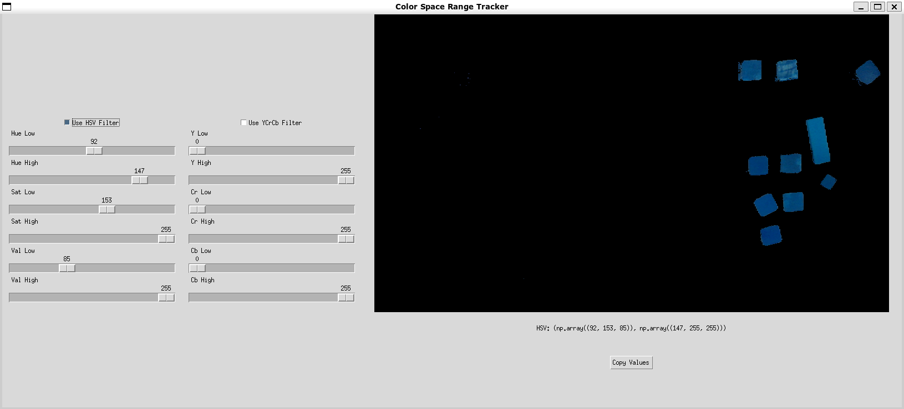
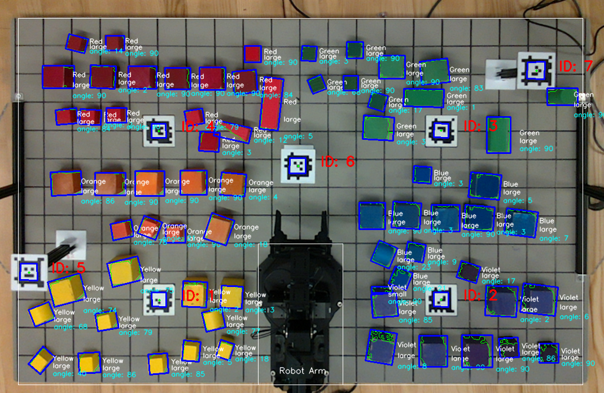

# Armlab-f23


## Introduction

The RX200 robotic arm project focuses on enhancing its autonomy through computer vision, kinematics, and path planning for block manipulation within a defined workspace.

## Key Features

- Computer Vision
- Workspace Reconstruction
- Forward and Inverse Kinematics
- Path Planning

## Camera Calibration, Coordinate Transformation, and Object Detection

Camera intrinsic and extrinsic calibration were performed to ensure accurate mapping from pixel to real-world coordinates. AprilTags were used for robust extrinsic calibration, achieving an error of less than 1 cm in workspace reconstruction. The detection system finds blocks, classifying them by size and color, and perform actions according to the specified tasks.

### Camera Intrinsic Matrix


| Method     | Intrinsic Matrix |
|------------|------------------|
| **Factory** | $$\begin{bmatrix} 900.715 & 0 & 652.287 \\ 0 & 900.192 & 358.36 \\ 0 & 0 & 1 \end{bmatrix}$$|
| **Measured** | $$\begin{bmatrix} 911.624 & 0 & 647.808 \\ 0 & 912.855 & 353.988 \\ 0 & 0 & 1 \end{bmatrix}$$|

### Camera Extrinsic Matrix


| Method     | Extrinsic Matrix |
|------------|------------------|
| **SolvePnP** | $$\begin{bmatrix} 0.999 & -0.039 & -0.015 & 12.557 \\ -0.037 & -0.988 & 0.15 & 191.363 \\ -0.021 & -0.149 & -0.989 & 1036.06 \\ 0 & 0 & 0 & 1 \\ \end{bmatrix}$$ |
| **Measured** | $$\begin{bmatrix} 0.999 & -0.034 & 0.009 & 12\\ -0.035 & -0.965 & 0.259 & 172\\ 0 & -0.259 & -0.966 & 1045\\ 0 & 0 & 0 & 1\\ \end{bmatrix}$$                     |

### Coordinate Transformation

### Block Detection

| Color SPace Tuning with HSV and YCrCb | Detection Result |
|---------------------------------------|------------------|
| |  |

## Robot Control

The robot arm's movements were based on the calculated kinematic solutions, with joint angles determined through inverse kinematics for the desired end effector positions.
Path planning algorithms were designed to navigate, grab, and place blocks efficiently, avoiding collisions.

## Results

The robotic arm successfully completed tasks involving block sorting, stacking, and alignment with high accuracy and autonomy.
Calibration processes were crucial for minimizing errors and enhancing task efficiency, with final task performances showing successful autonomous manipulation within the workspace.

## Code structure

```bash
root/
│── config
│   ├── rx200_dh.csv                         # Contains the DH table for the RX200 arm
│   └── rx200_pox.csv                        # Contains the S list and M matrix for the RX200 arm
│── data
│   ├── ost1.txt                             # ost1.txt ~ ost5.txt are the files for calibration 
│   ├── ost2.txt
│   ├── ost3.txt
│   ├── ost4.txt
│   ├── ost5.txt
│   └── *.png
├── install_scripts
│   ├── config
│   │   ├── rs_l515_launch.py                # To launch the camera
│   │   └── tags_Standard41h12.yaml          # To define the AprilTags used on the board
│   ├── install_Dependencies.sh              # To install ROS2/All the ROS wrappers/Dependencies
│   ├── install_Interbotix.sh                # To install arm related stuff
│   └── install_LaunchFiles.sh               # To move the files under `/config` to where they should be
├──            launch                        # To store the launch files, details in here
│   └── README.md                            # Documentation for launch files
├── media                                    # where we store media that used for README instructions
└── src
    ├── resource                             # where we store the additional files used in the project
    ├── camera.py                            # Implements the Camera class for the RealSense camera
    │                                           - Functions to capture and convert frames
    │                                           - Functions to load camera calibration data
    │                                           - Functions to find and perform 2D transforms
    │                                           - Functions to perform world-to-camera and camera-to-world transforms
    │                                           - Functions to detect blocks in the depth and RGB frames
    ├── control_station.py                   # Main program for setting up threads and callback functions
    │                                           - This is the main program. It sets up the threads and callback functions. 
    │                                             Takes flags for whether to use the product of exponentials (PoX) or Denabit-Hartenberg (DH) table 
    │                                             for forward kinematics and an argument for the DH table or PoX configuration. 
    ├── kinematics.py                        # Implements functions for forward and inverse kinematics
    ├── rxarm.py                             # Implements the RXArm class
    │                                           - Feedback from joints
    │                                           - Functions to command the joints
    │                                           - Functions to get feedback from joints
    │                                           - Functions to do FK and IK
    │                                           - A run function to update the dynamixiel servos
    │                                           - A function to read the RX200 arm config file
    └── state_machine.py                     # Implements the StateMachine class
                                                - The state machine is the heart of the controller
```

## How to start?

1. Go to [/install_scripts](install_scripts) and following the `README.md` instructions
2. Go to [/launch](launch) to start the ROS2 nodes with the `.sh` files following the `README.md` instructions
